

  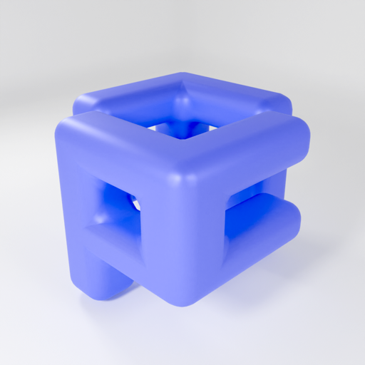

<h1 align="center">PulseCraft Studio</h1>

<strong>3D Animation Editor & Renderer for iPhone & iPad</strong>

  A powerful 3D scene builder and animation editor made for iOS. 
  Create complete 3D worlds, keyframe-animate anything, and export cinematic videos — right on your device.

  

---

## Rendered Output

| | |
|:---:|:---:|
| 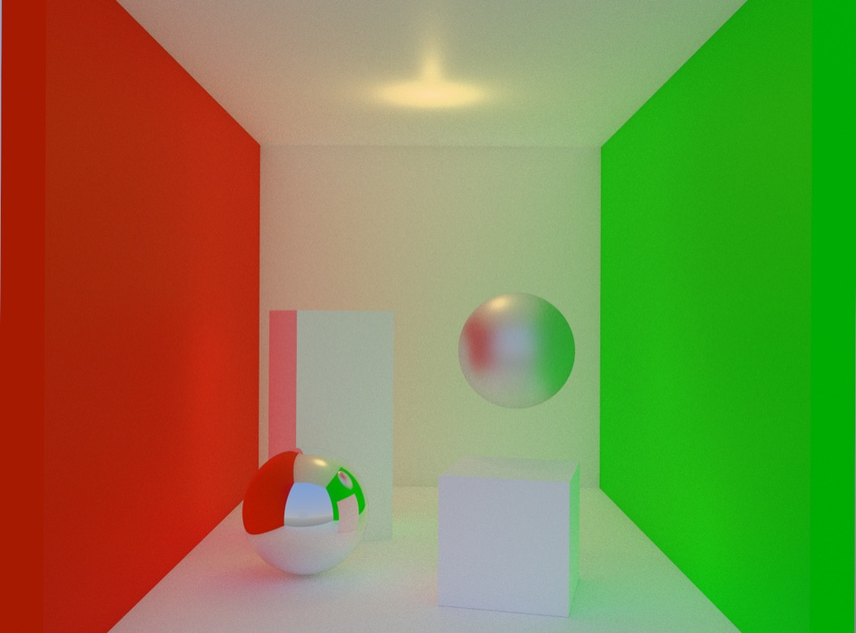 | 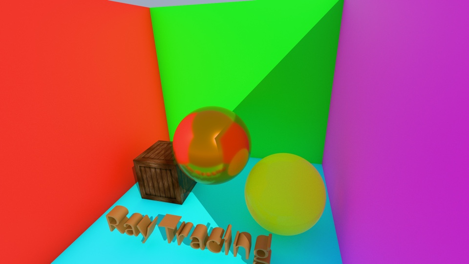 |
| **Cornell Box** — Reflections, soft shadows, and global illumination | **Ray Traced Scene** — Colorful materials and path-traced lighting |

---

## Everything You Need

**PBR Materials** — Base color, metalness, roughness, specular, clearcoat, opacity, emission, and texture maps. Create glass with refraction and transmission controls.

**60 fps Timeline** — Keyframe position, rotation, scale, materials, lights, cameras, and geometry dimensions. Scrub, set keyframes, and preview smooth playback instantly.

**Cinematic Cameras** — Multiple cameras with field of view, depth of field (focal distance + f-stop), orbit controls, and quick view snaps. Optional HDR tone mapping.

**Dual Rendering** — RealityKit rasterizer for fast real-time output, or Metal ray tracer for photoreal path tracing with soft shadows and realistic refraction (A14+). Up to 512 samples per pixel and 8 max bounces.

**Export Up to 4K** — Render HEVC MP4 videos or PNG stills at 480p, 720p, 1080p, or 4K UHD. Preview before export, share via the iOS Share Sheet.

**Designed for Touch** — Tap to select, drag to orbit, pinch to zoom, long-press to focus. Color-coded XYZ gizmos and full undo/redo.

---

## Built-in 3D Primitives

Start creating instantly with 11 built-in shapes, or import your own USDZ models.

| | | | | |
|:---:|:---:|:---:|:---:|:---:|
| 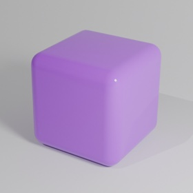 | 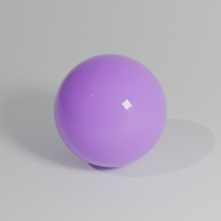 | 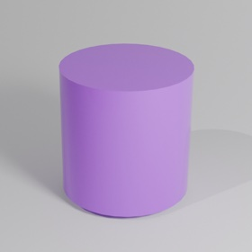 | 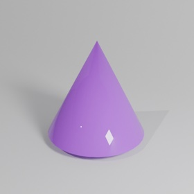 | 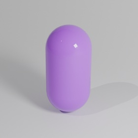 |
| Box | Sphere | Cylinder | Cone | Capsule |
| 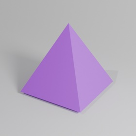 | 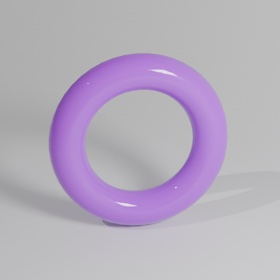 | 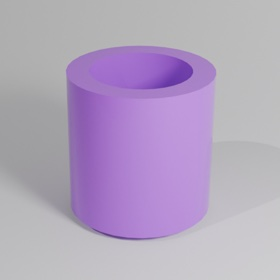 | 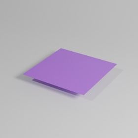 | 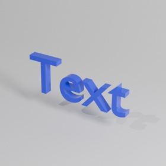 |
| Pyramid | Torus | Tube | Plane | 3D Text |

---

## Pro Lighting

Ambient, directional, point, and spot lights — all fully animatable.

| | |
|:---:|:---:|
| 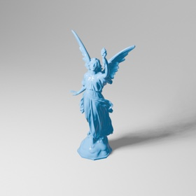 | 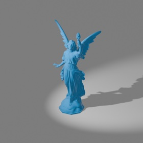 |
| Directional Light | Spot Light |

---

  Whether you're prototyping motion ideas, learning 3D, or creating social content — PulseCraft Studio gives you a full 3D animation pipeline, anywhere you go.

  

&copy; 2025 PulseCraft Studio. All rights reserved.

